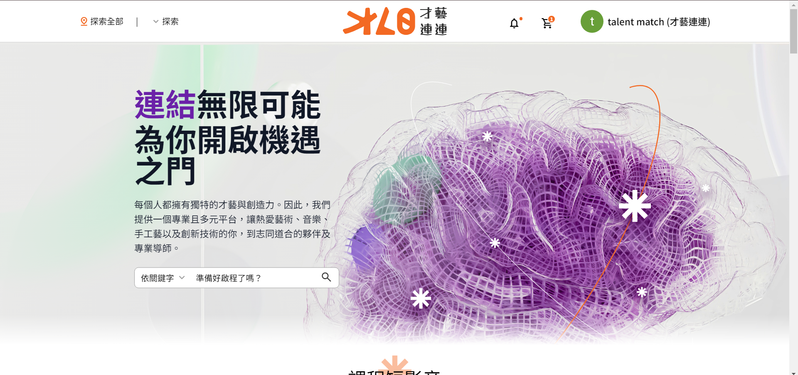

# 才藝連連 Talent Match
## [前往網站](https://talent-match-frontend.onrender.com)

## 專案說明
才藝連連 Talent Match 是一個創新的線上平台，靈感來源於 amazingTalker。相較於 amazingTalker 主要聚焦於語言教學，才藝連連則拓展了教學範疇，不僅限於語言，更包括各式各樣的才藝。此平台旨在為教師提供一個自由展現並教授多樣才藝的場所，無論是音樂、藝術、編程還是健身等，教師都可以根據自己的專長設計課程。學生則能夠依據自己的興趣輕鬆地在此平台上尋找並學習感興趣的才藝課程。透過靈活的教學模式和多元化的課程選擇，才藝連連致力於創造一個促進學習與成長的互動環境。

## 專案架構
### 資料夾說明
* libs
  * openapi - angular http service
  * shared - 共用元件
* src
  * pages - 頁面組件
    * layout - 頁面共用組件
  * shared - 專案共用服務
  * guards - angular router guard
* assets
  * images - 專案圖片
* scss 
  * base - 基本樣式設定
  * overrides - 樣式客製化覆蓋
### 專案技術
* Node.js v18.0.0
* Angular v17.3.0
* Angular Cdk v17.3.10
* Fullcalendar v6.1.11
* Tailwindcss v3.4.3
* Openapi Generator v2.13.4
* Eslint v8.57.0
### 安裝與啟動
下載 talent-match-frontend 以及 talent-match-backend 專案至本地
```bash
git clone <remote-url>
```
安裝套件
```bash
npm install 
```
產生 angular api service
```bash
npm run openapi:client
```
開啟前後端專案並執行指令

前端
```
npm start
```
後端
```
npm run start:dev
```
## CI/CD 說明

這個 GitHub Actions 工作流程在對 `develop` 分支發起 pull request 時觸發，旨在自動化檢查、測試、生成和部署過程。

### 觸發條件

工作流程會在對 `develop` 分支的 pull request 時自動觸發。

### 工作流程詳情

#### 設置環境

- **運行環境**: Ubuntu 最新版本
- **步驟**:
  1. 檢出代碼。
  2. 設定 Node.js (版本 18)。
  3. 快取 Node 模組。
  4. 安裝依賴。

#### 代碼檢查

- **依賴**: `setup`
- **步驟**:
  1. 檢出代碼。
  2. 恢復 Node 模組快取。
  3. 安裝依賴。
  4. 執行 ESLint。

#### 生成 OpenAPI 客戶端

- **依賴**: `setup`
- **步驟**:
  1. 檢出代碼。
  2. 恢復 Node 模組快取。
  3. 安裝依賴。
  4. 生成 OpenAPI 客戶端。
  5. 上傳生成的 OpenAPI 客戶端至工件存儲。

#### 部署

- **依賴**: `lint`, `openapi-generate`
- **步驟**:
  1. 檢出代碼。
  2. 恢復 Node 模組快取。
  3. 設定 Node.js。
  4. 安裝依賴。
  5. 下載 OpenAPI 客戶端。
  6. 構建專案。
  7. 部署至 GitHub Pages。
  8. 部署至 Render。

## 聯絡開發人員
* Thomas [Github連結](https://github.com/th1230)
* Olive [Github連結](https://github.com/emmablur)
* 刺蝟 [Github連結](https://github.com/hedgehog-chien)
* Shiba0926 [Github連結](https://github.com/justine92415)
